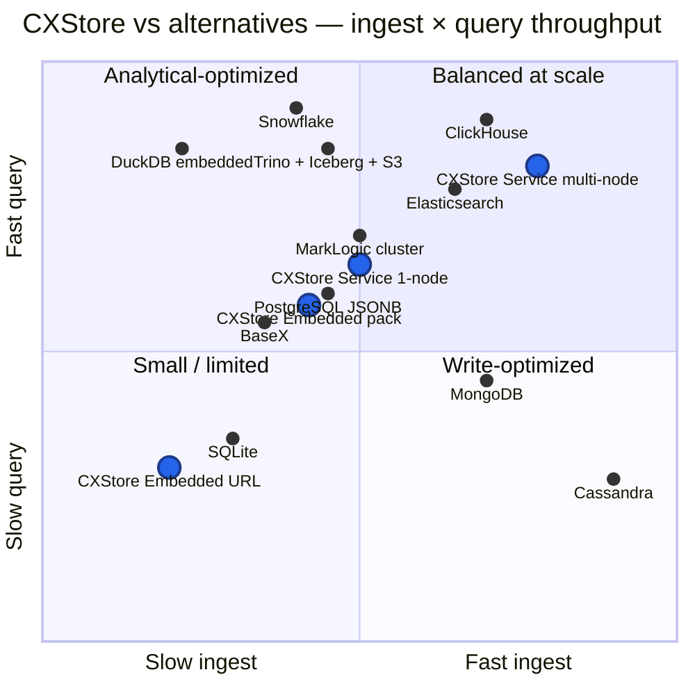
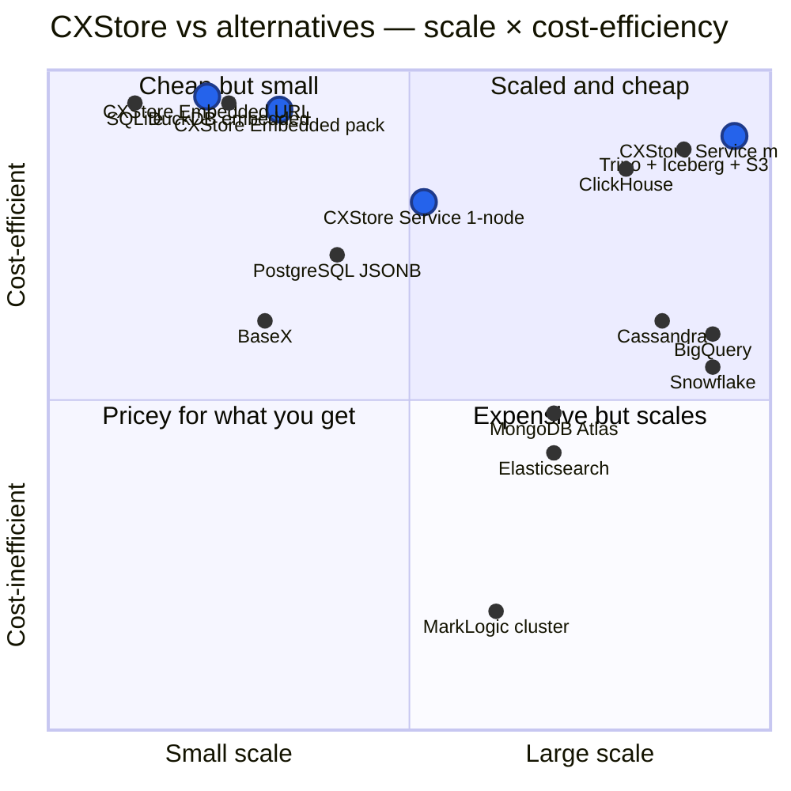

# CXStore — Performance Expectations

**INTERNAL — DO NOT PUBLISH. DO NOT MIRROR TO `cx-home/cx`. SEE [`README.md`](README.md).**

**Status:** Draft. Engineering estimates from peer-system benchmarks; no measured CXStore numbers yet. Updated as Phase 0.5 / 0.7 / 1 / 2 / 3 produce real measurements.

**Purpose.** Where CXStore's four shapes sit against alternatives on performance, scale, and cost. Companion to [`plan.md`](plan.md).

---

## Honest framing

Every number below is **estimated**, not measured, until CXStore exists to benchmark. Sources:

- CX-specific baselines from perf gates (gate 15 streaming throughput, gate 16 HTTP service throughput).
- Peer-system benchmarks from published papers, blog posts, and known production deployments (Snowflake, DuckDB, Trino, Elasticsearch, MarkLogic, Cassandra, etc.).
- Standard distributed-systems extrapolations (Amdahl, S3 bandwidth ceilings, hardware-accelerated SHA-256 throughput).

When a measurement contradicts an estimate, **the measurement wins** and this doc gets updated. Treat estimates as falsifiable predictions, not advertising.

---

## CX-specific baselines (measured)

| Metric | Source | Number |
|---|---|---|
| Streaming evaluator on JSON-shape workloads | gate 15 measured on M-series | 353 MB/s |
| HTTP service throughput | gate 16 measured | ~87 K req/s |
| ast_bin parse floor | gate 15 requirement | ≥ 200 MB/s |
| SHA-256 hash compute (hw-accelerated) | industry standard | ~500 MB/s/core |
| Python decoder ceiling at 1 MB | architectural | ~90 ms |

These set the per-node primitives. Everything else is "what happens when we run these in-process (Embedded), push them to a remote node (Service single-node), or fan out across many nodes (Service distributed)."

---

## Qualitative line (where processing happens)

The Embedded vs Service split is **where the processing runs**, not where the bytes live:

- **Embedded** processes data in the client process even when bytes are pulled from S3 or FTP. Throughput is bounded by *client CPU + client bandwidth to byte source + transfer of all corpus bytes to client*.
- **Service** pushes the computation to a remote node and streams binary matches back. Throughput is bounded by *server CPU + server bandwidth to byte source + transfer of matches to client*.

For queries with **high selectivity** (matches are small fraction of corpus), Service wins by orders of magnitude because it doesn't ship the full corpus to the client. For queries with **low selectivity** (most docs match) or single-doc-fetch workloads, Embedded is competitive.

---

## Performance by workload type

### (Q1) Point lookup by hash

| Deployment | p50 | p99 | Notes |
|---|---|---|---|
| Embedded, pack backend (mmap, hot OS cache) | <100 µs | <500 µs | bloom + index + memcpy |
| Embedded, URL-dispatched (LocalFiles) | <500 µs | <2 ms | filesystem stat + read |
| Embedded, URL-dispatched (S3) | 30–100 ms | 100–500 ms | S3 GET latency dominates |
| Service single-node (Phase 0.7) | <1 ms | <5 ms | CSRP + local pack lookup |
| Service multi-node, hot tier | 1–5 ms | 10–20 ms | metadata in FDB + cached pack |
| Service multi-node, cold (S3 fetch) | 30–100 ms | 100–500 ms | S3 latency dominates |
| Service multi-node + Redis cache | <1 ms | <5 ms | even for cold data |

**Aggregate throughput:** Service multi-node sustains ~100 K–1 M point lookups/sec with proper caching and shard count.

### (Q2) Indexed query (`//user[@active=true]`)

Requires Phase 1's secondary indexes (pack-backed Embedded, or Service running pack-backed Embedded internally).

| Deployment | p50 | p99 |
|---|---|---|
| Embedded pack + attribute index | 1–10 ms | 50 ms |
| Embedded URL-dispatched (no index) | full scan; see Q3 | — |
| Service single-node | 5–20 ms | 100 ms |
| Service multi-node (sharded index) | 20–100 ms | 200–500 ms |

**Throughput:** ~10 K–100 K indexed queries/sec aggregate. Latency dominated by payload fetch, not index probe.

### (Q3) Full structural scan (unindexed CXPath)

The scenario where the **Embedded vs Service distinction matters most.**

| Deployment | Throughput | 1 TB scan time |
|---|---|---|
| Embedded streaming (local bytes) | ~350 MB/s | ~50 min |
| Embedded URL-dispatched (S3 bytes) | ~50–100 MB/s | bandwidth-bound; impractical >100 GB |
| Service single-node (local bytes) | ~350 MB/s | ~50 min |
| Service multi-node, 10 workers | ~3.5 GB/s | ~5 min |
| Service multi-node, 100 workers | ~35 GB/s | ~30 sec |
| Service multi-node, 1000 workers | ~100–200 GB/s | ~5–10 sec |

**Key insight:** Embedded-over-remote-byte-source is **fundamentally limited by client bandwidth** because the whole corpus must be transferred for an unindexed scan. Service pushes the predicate to where the bytes live; only matches transfer back. For queries with 0.01% selectivity on 1 TB, Embedded transfers 1 TB; Service transfers ~100 MB.

**Service multi-node, 1 PB scan with 1000 workers: ~1–2 hours.** Linear scaling holds to ~1000 workers; past that S3 per-bucket bandwidth becomes the ceiling.

### (Q4) Analytical aggregates via CXCol → Parquet

| Deployment | Throughput | 1 B row aggregate |
|---|---|---|
| Single-node DuckDB on Parquet | ~5 GB/s/query | <1 sec on laptop |
| Trino cluster, 100 workers | ~50–100 GB/s | <1 sec |
| Snowflake-class warehouse | comparable | <1 sec |

For queries that project cleanly to relational schemas, Service multi-node via CXCol matches Snowflake-class warehouses within ~2× at ~10–20× lower cost.

### (Q5) Write throughput / ingest

Bottleneck = ast_bin parse at ~350 MB/s per thread.

| Workload | Sustained rate | Cluster size |
|---|---|---|
| 1 B docs/day | 11.5 K docs/sec | trivial — single node |
| 100 B docs/day | 1.15 M docs/sec | 1–4 nodes |
| 1 T docs/day | 11.5 M docs/sec | 10–40 nodes |

10× burst over sustained is the typical safety margin (Kafka buffering in Service multi-node).

### (Q6) Concurrent query throughput (workload isolation)

Service multi-node differentiates here via elastic compute.

| Workload mix | Embedded / Service single-node | Service multi-node |
|---|---|---|
| 1000 lookups/sec + 1 full-scan | scan blocks lookups | isolated worker pools |
| 10 analytical queries simultaneously | serialized | parallelized |
| Tenant A scan + Tenant B lookups | A starves B | quota-isolated |

---

## Scale envelope per deployment shape

| Shape | Data capacity | Query latency floor | Aggregate throughput |
|---|---|---|---|
| Embedded URL-dispatched | bounded by client + byte-source throughput | ~500 µs (local) to ~100 ms (S3) | ~100 MB/s (local) to bandwidth-bound (remote) |
| Embedded pack | 100s of GB (host bound) | <100 µs | single-process |
| Service single-node (Phase 0.7+2, NVMe) | ~10–60 TB / ~10–100 B small docs | <1 ms | ~1 GB/s scan, ~10 K rps |
| Service multi-node, 10-node cluster | ~500 TB / ~500 B docs | ~1 ms | ~10 GB/s scan, ~100 K rps |
| Service multi-node, 100-node cluster | ~5 PB / ~5 T docs | ~1 ms | ~100 GB/s scan, ~1 M rps |
| Service multi-node, S3-backed elastic | unbounded | ~10–100 ms cold | scales with worker spawn |

---

## Chart 1 — Ingest × query throughput

### Positioning rationale (chart 1)

| Position | Why there |
|---|---|
| **Embedded URL-dispatched** (0.20, 0.30) | Files / HTTP / S3 byte sources; no indexes; client-side O(N) processing; ingest bound by client + transfer; query bound by full-corpus transfer to client. Slow on both axes, ubiquitous, day-1 shippable. |
| **Embedded pack** (0.42, 0.58) | Single-process, mmap'd, indexed; comparable to BaseX. Bounded by one box. |
| **Service single-node** (0.50, 0.65) | Server-side pushdown via CSRP; client gets matches not corpus. Modest gains over Embedded pack from pushdown + better concurrency. |
| **Service multi-node** (0.78, 0.82) | Elastic compute over S3-backed packs; Snowflake-shape via CXCol + Elasticsearch-shape via native CXPath. |

**Key comparisons:**

- **vs BaseX:** Embedded pack matches it; Service multi-node pulls 2–3× ahead on both axes.
- **vs MarkLogic:** Service multi-node positions slightly ahead via elastic compute + S3 economics. MarkLogic's universal index gives it a tighter per-node profile; CXStore wins on scale-out cost.
- **vs Elasticsearch:** Roughly comparable; ES wins on out-of-the-box text search, CXStore wins on structural CXPath.
- **vs DuckDB embedded:** DuckDB beats every CXStore shape on analytical single-node queries — but DuckDB writes are slow and analytical-only. CXStore's CXCol path *delegates* to DuckDB/Trino; we don't compete, we route.
- **vs Snowflake:** Snowflake's analytical query throughput is hard to match. Service multi-node via CXCol → Parquet → Trino gets within ~2× at ~10–20× lower cost. For structural (non-analytical) query, CXStore wins outright.
- **vs Trino + Iceberg + S3:** Service multi-node *is* this architecture with CXPath as surface and ast_bin as cell format. Positioning is similar; CXStore claims a specific format + query-language opinion.
- **vs Cassandra:** Different category. Cassandra wins on raw write throughput at simple-query cost; not the trade CXStore makes.

---

## Chart 2 — Scale × cost-efficiency

### Positioning rationale (chart 2)

**X-axis (scale):** addressable data capacity — small embedded → planet-scale distributed.
**Y-axis (cost-efficiency):** capacity delivered per dollar (storage + compute + licensing + ops). Higher = more capacity per $.

| Position | Why there |
|---|---|
| **Embedded URL-dispatched** (0.22, 0.96) | Uses storage you already have (files, HTTP, S3). No new infrastructure cost. Limited scale per host. |
| **Embedded pack** (0.32, 0.94) | Single binary, no servers, no licenses. Bounded scale; near-zero ops. |
| **Service single-node** (0.52, 0.80) | One box's worth of ops. Real ceiling on scale but real ops cost too. |
| **Service multi-node** (0.95, 0.90) | S3-backed; elastic compute = $0 idle. Same cost-efficiency profile as Trino + Iceberg, with CXStore-specific feature set. |

**Key comparisons:**

- **vs MarkLogic cluster (0.62, 0.18):** Where CXStore Service's strategic claim lives. MarkLogic licensing is $100K–$1M+/year/cluster; Service multi-node runs on S3 + commodity compute at ~10–20× lower TCO. This is the wedge.
- **vs Snowflake / BigQuery:** Comparable on scale; Service multi-node is more cost-efficient because compute is on-demand workers rather than provisioned warehouses. Snowflake wins on operational maturity; CXStore wins on per-query cost at moderate-to-high QPS.
- **vs Trino + Iceberg + S3:** Same cost-efficiency profile (S3 + workers). CXStore's distinction is the format + query language opinion, not the economics.
- **vs Elasticsearch:** ES is RAM-hungry; cost per TB at scale is high. Service's S3-first storage flips this — most data lives cheaply, hot tier is small.
- **vs ClickHouse (0.80, 0.85):** ClickHouse open-source self-hosted is very efficient for analytical workloads. Service's claim against it: better tree-structural queries, comparable cost.

**The strategic positioning the chart makes visible:**

CXStore's full product line traces a path through Q2 → Q1 (top-left → top-right): start cheap+small, grow cheap+huge. **No CXStore shape lives in Q3 or Q4.** Compare to MarkLogic (Q4, expensive enterprise) or DynamoDB/Atlas (drifting into Q3 at scale). The cost story is consistent across deployment shapes — that's the pitch.

---

## What the charts deliberately don't show

A 2-axis chart compresses real performance space hard:

1. **Query shape variance.** A system can be fast on point lookups and slow on aggregates (or vice versa). Snowflake's high Y on chart 1 applies to analytical aggregates; for point lookups by primary key it's slower than DynamoDB.
2. **Selectivity.** Embedded vs Service performance differs by orders of magnitude based on how selective the query is — the chart shows averages.
3. **Concurrency profile.** Service multi-node at 1 QPS vs 1000 QPS behaves very differently. Embedded and SQLite degrade hard under concurrent load.
4. **Tail latency.** Mean throughput hides p99, where distributed systems often regress vs single-node.
5. **Operational complexity.** Embedded URL-dispatched: zero ops. Service multi-node: significant ops. Not on either chart.
6. **Data shape suitability.** RDF graphs, time-series, full-text, ML embeddings — each system has a sweet spot.
7. **Vendor lock-in / portability.** S3-backed Service → portable. Snowflake/BigQuery → less so.
8. **Maturity.** CXStore is a *proposal* on these charts. Every other system is shipping production code with years of optimizer engineering.

Each of these justifies its own chart if useful. The two views above are the most common "where does this fit" questions.

---

## Tail latency (p99 honesty)

Distributed systems regress on tail latency. The bigger the fan-out, the worse the p99 vs p50 ratio.

**Realistic p99 targets for Service multi-node:**

| Operation | p99 well-engineered | p99 out-of-the-box |
|---|---|---|
| Point lookup, hot | 5 ms | 50 ms |
| Point lookup, cold (S3) | 100 ms | 1 s |
| Indexed query, simple | 100 ms | 500 ms |
| Indexed query, complex | 500 ms | 5 s |
| Full scan (well-sized cluster) | 1.5× p50 | 3–5× p50 |

The "well-engineered" column requires hedged requests, request coalescing, tuned timeouts, and tail-latency-aware schedulers. Default to "out-of-the-box"; budget for engineering investment to hit "well-engineered."

---

## What Service multi-node fundamentally cannot do well

Being honest about ceilings (also captured in [`plan.md`](plan.md) and worth restating):

1. **Sub-millisecond cold lookups.** S3 floor is ~10 ms. If you need <1 ms always, you need an Embedded cache (or a Service single-node with local NVMe) in front.
2. **Heavy in-place mutation.** Pack files are immutable. Update-heavy workloads = OLTP database territory, not CXStore.
3. **Synchronous multi-doc ACID.** Cross-doc transactions need a coordinator or external transaction log.
4. **Low-latency joins across large tables.** Distributed joins at lake scale are expensive. Use CXCol projection + columnar engine.
5. **Real-time-from-just-written.** Ingest → pack → index has latency. Point lookup by hash is immediate; structural query may lag by seconds.

---

## Measured baselines (to be filled as Phase 0.5+ ships)

| Workload | Embedded URL | Embedded pack | Service 1-node | Service multi-node |
|---|---|---|---|---|
| Point lookup p50 | — | — | — | — |
| Point lookup p99 | — | — | — | — |
| Indexed query p50 | n/a | — | — | — |
| Indexed query p99 | n/a | — | — | — |
| Scan throughput (1 GB) | — | — | — | — |
| Scan throughput (1 TB) | n/a | n/a | — | — |
| Pushdown selectivity 0.01% on 1 TB | — | — | — | — |
| Ingest sustained rate | — | — | — | — |
| Ingest burst rate | — | — | — | — |
| Concurrent point QPS | — | — | — | — |

Each cell gets a measurement + commit hash + workload description as it lands. Reset estimates above when measurements contradict.

---

## Methodology (when measurements happen)

- **Hardware baseline:** M-series Apple Silicon (matches gate 15's 353 MB/s measurement) + commodity x86 NVMe box for cross-check.
- **Workloads:** synthetic generators producing 1 KB / 10 KB / 100 KB / 1 MB doc shapes; real corpora as they become available.
- **Repetitions:** 100 trials per measurement; report p50 / p95 / p99 / max + standard deviation.
- **Warm-up:** 30 s warm-up before steady-state measurement.
- **Cold-cache measurement:** drop OS caches; for Service, drop worker caches; for S3, use random keys to defeat caching.
- **Selectivity sweep:** measure scan workloads at 100% / 1% / 0.01% / 0.0001% selectivity to expose Embedded-vs-Service crossover points.
- **Reproducibility:** commit the benchmark script + workload generator alongside the result.

Detailed methodology will land in a `conformance/cxstore_bench.txt` fixture suite once Phase 0.5 ships.

---

## Cross-references

- [`plan.md`](plan.md) — overall design, phase plan, decision gates.
- [`embedded.md`](embedded.md) — Phase 0.5 spec (URL-dispatched Embedded Store).
- [`pack_format.md`](pack_format.md) — Phase 1 pack file layout (indexed-perf Embedded backend).
- `spec/misc/cxstore-remote-protocol.md` — CSRP spec (Service tier wire protocol; pending Phase 0.7).
- Perf gates (15, 16) — `spec/v0_8_0_status.md`. <!-- version-literal-ok -->
